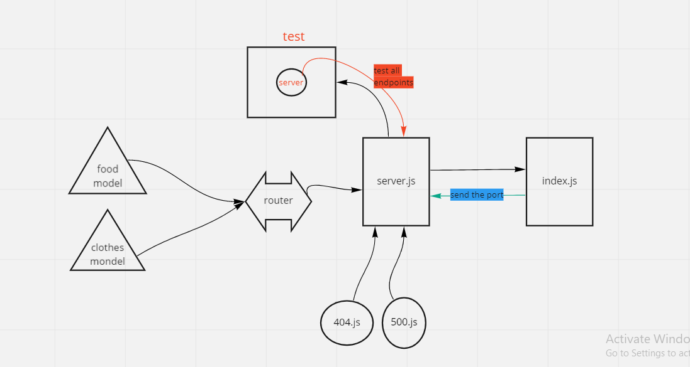

# basic-api-server

*Auther: Abeer Rafati*

**This app to explain how to creat a server with routers and test it for deployment(Heroku)**   

[Produchion deployment](https://class03-server.herokuapp.com)    
[Pull req](https://github.com/AbeerAl-Rafati/basic-api-server/pull/2)   

*To use this app:*
- clone this repo  
- `cd First_api_server` 
- to download all dependencies used in this app, use in terminal 
> `npm i` 
- to run the server use in terminal  
> `nodemon` 
> try to use  `/food` and `/clothes` in postman with the deployment link and check the data online
- to run test it use in termintl 
> `npm test`    

